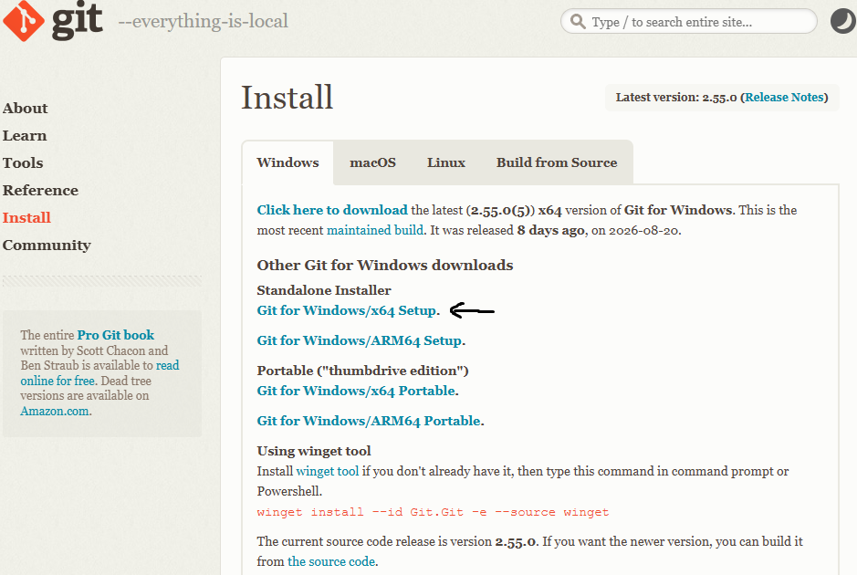

# Plantilla del Curso de Programación Web 

2026-2

---

## Descripción del Proyecto

Esta plantilla implementa una aplicación web full-stack utilizando React.js + Vite para el frontend y Node.js + Express para el backend. El proyecto está organizado para separar la interfaz, lógica de negocio, acceso a datos y configuración, permitiendo desarrollar tanto el sitio web como un panel administrativo.

La aplicación utiliza Supabase como base de datos y dispone de migraciones SQL para gestionar su estructura y datos iniciales. Además, incluye configuración para Vercel, vistas EJS para páginas del servidor y una API organizada mediante controladores, servicios y repositorios.

| Carpeta | Descripción |
|---|---|
| `admin/` | Lógica del panel administrativo: APIs, controladores, modelos, repositorios y servicios. |
| `api/` | Punto de entrada de la API del servidor. |
| `configs/` | Configuración general, base de datos, middlewares y funciones auxiliares. |
| `db/` | Esquema y migraciones SQL de la base de datos Supabase. |
| `docs/` | Documentación técnica, incluyendo el diagrama de la base de datos. |
| `public/` | Archivos públicos y recursos estáticos. |
| `src/` | Aplicación React: páginas, componentes, estilos, helpers y entradas de la aplicación. |
| `views/` | Plantillas EJS para las páginas renderizadas por Express. |
| `website/` | Lógica del sitio web: APIs, controladores, modelos, repositorios, rutas y servicios. |
| `server.js` | Archivo principal para iniciar y configurar el servidor Express. |

## Comandos GIT

Crear proyecto GIT

    > git init

Descargar GIT del [enlace](https://git-scm.com/install/windows)
    

Loguearse

    > git config --global user.name "Angelo de Paz"
    > git config --global user.email "angelo@email.com"

Crear rama

    > git checkout -b feature/prueba

Ver rama

    >  git branch

Cambiar rama

    > git checkout #nombre_rama

Cambiar a commit

    > git reset --hard #commit

Instalar dependencias:

    > npm install

Cambiar remote

    > git remote set-url origin git@github.com:Tangelo458/Progra_web.git

npm install -g vercel
vercel login
vercel --prod

==========================================
CONFIGURACIÓN E INICIALIZACIÓN
==========================================
Configurar identidad (solo la primera vez)
git config --global user.name "Tu Nombre"
git config --global user.email "tu@email.com"

Inicializar un nuevo repositorio Git en la carpeta actual
git init

Vincular la URL remota mediante SSH
git remote add origin git@github.com:jovaldiv-ops/pw-2026-2.git

Opcional: Si necesitaras cambiar la URL remota en el futuro, usarías:
git remote set-url origin git@github.com:Tangelo458/Progra_web.git

==========================================
SEGUIMIENTO Y CONFIRMACIÓN DE CAMBIOS
==========================================
Ver el estado actual de los archivos (nuevos, modificados)
git status

Añadir todos los archivos al área de preparación (staging)
git add .

Guardar los cambios en el historial local con un mensaje
git commit -m "Trabajo del dia Viernes 4/9/2026 (S2 - D2) - Cambios en el login, uso de CSS y creación de dashboard.html"

Verificar el historial de commits creados
git log --oneline

==========================================
SINCRONIZACIÓN Y ENVÍO A GITHUB
==========================================
Descargar y fusionar cambios del repositorio remoto si los hay
git push -u origin master
git pull origin master